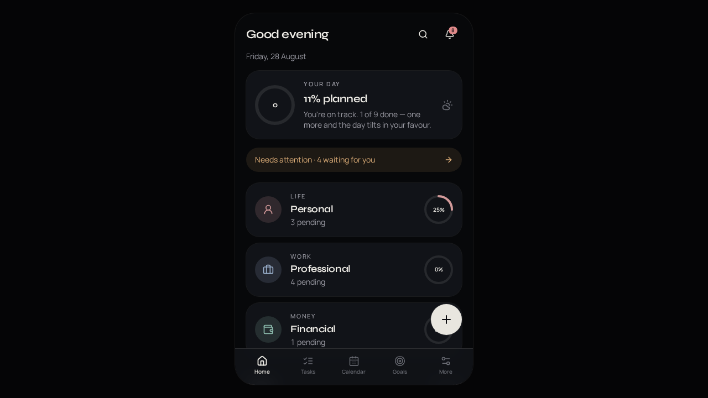
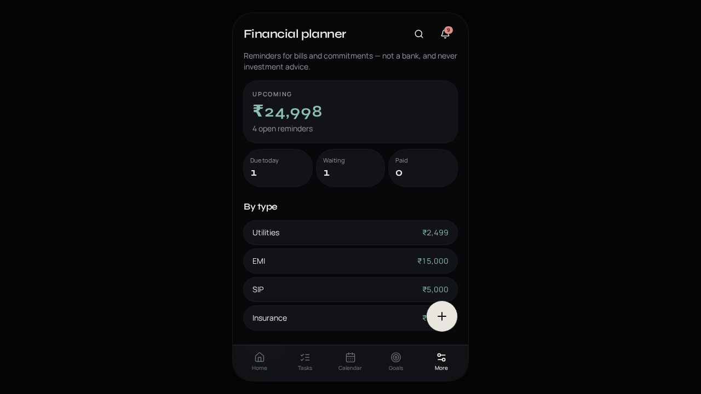
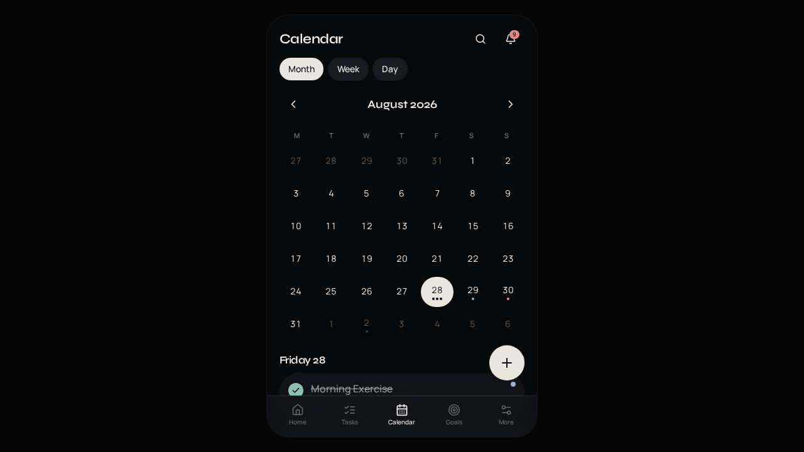

# Alpha Scheduler

**Plan better. Remember everything. Get things done.**

A premium personal · professional · financial planner for Android.

## Download

**[Download AlphaScheduler.apk](https://github.com/naveenans/alphascheduler/releases/latest/download/AlphaScheduler.apk)** — v1.0.0 · 2.9 MB · Android 8.0+

1. Open the link on your phone.
2. Allow install from this source if Android asks.
3. Open the APK and tap **Install**.
4. Allow notifications so reminders can appear.

Sideloaded (not from Play Store). Data stays on the device.

## What it does

| | |
| --- | --- |
| **Personal** | Health, family, home, daily rituals |
| **Professional** | Meetings, follow-ups, projects |
| **Financial** | Bills, EMI, SIP, insurance reminders |

- Quick add with natural language (`Call client tomorrow at 10 AM`)
- Calendar (month / week / day)
- Goals, habits, and streaks
- Recurring tasks and reminders
- Dark / light theme
- Works offline — everything is stored locally

Financial entries are reminders only. Do not store card PINs, passwords, or bank credentials.

## Screenshots

  
  
  

## License

Personal use. Built for Alpha Scheduler.
